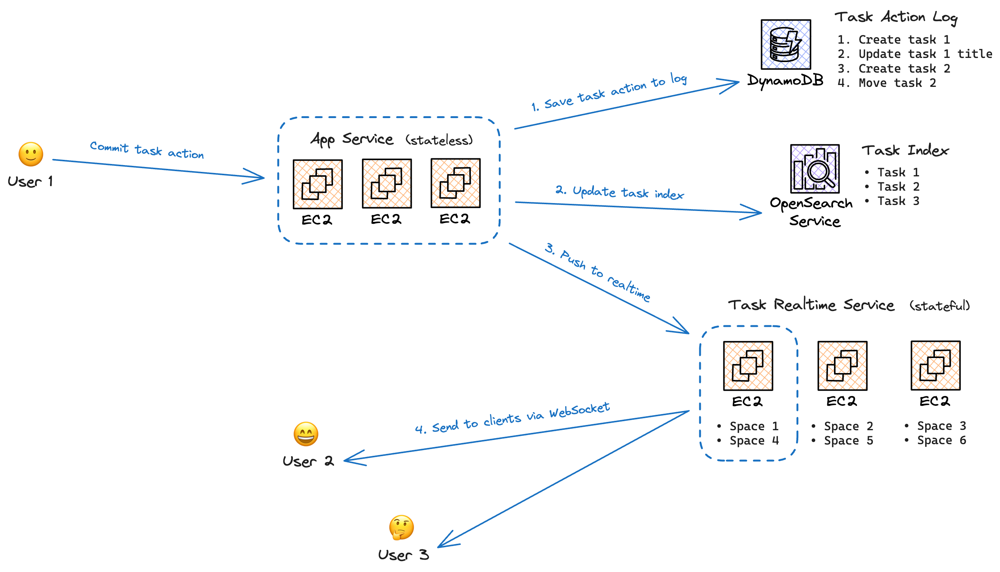
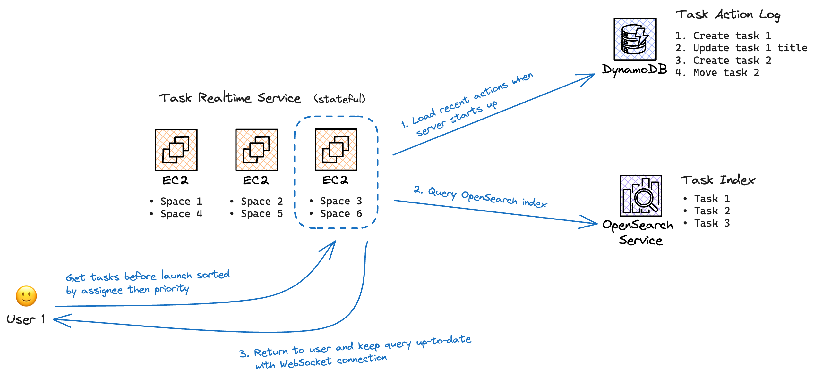

# \[2023-07-14\] Task System

## Context

We’re building a collaborative task management product and need to decide on a backend
implementation. A couple key things our product needs to support:

- **Scale:** It should be just as easy to create a task as adding a new line to a document. That
  means organizations will quickly end up with hundreds of thousands of tasks that are never
  deleted. The ever-growing total number of tasks in an organization should not slow down the
  product.

- **Arbitrary querying:** There are a couple standard access patterns. For example, “show me tasks
  assigned to me” or “show me tasks in a given collection.” Then there is a long tail of arbitrary
  queries. For example, “show me tasks due after our launch date sorted by assignee then sorted by
  priority.”

- **Realtime:** Two users should be able to collaborate on tasks at the same time and see each
  others updates. Including a single task view, a collection task view, or an arbitrary query.

- **Permissions:** A user’s personal tasks should not be visible to any other user. A user should
  also be able to create private collections shared with a couple people that no one else can see.
  If a user loses access to a task they should no longer be able to view or make changes. However,
  if a user performs an action that causes them to lose access (e.g. removing a collection that
  granted them access) they should be able to undo the change within a short window of time. (In
  case the change was an accident.)

Some tradeoffs we’re ok making on these system requirements:

- **Scale:** Supporting large scale within a single organization can be sacrificed as long as we can
  have multiple organizations of moderate scale. Ideally, we wouldn’t have a task limit per
  organization but we can accept a limit in the range of 500k–5M for now.

- **Arbitrary querying:** Arbitrary queries need to be at minimum executable but can be slow on
  initial execution. Ideally arbitrary queries should be fast if the query is frequently accessed
  (say a team uses an arbitrary query for sprint planning) but that’s an optimization we can add
  later.

- **Realtime:** Task editing realtime latency doesn’t need to be as good as document editing
  realtime latency. It should still be <1–3s but doesn’t need to be <1s. Realtime updates also don’t
  need to be strictly ordered. Clients can have eventually consistent views of their data. Local
  updates should be optimistic, though, and not require a roundtrip to show up in the UI.

- **Permissions:** Permission rule changes don't have to take effect instantly. They can take <2
  minutes to take effect. Allowing authorization decisions to be eventually consistent allows us to
  design a more distributed system.

## Decision

We introduce the following to our architecture:

- [DynamoDB](https://aws.amazon.com/dynamodb/) task action log table
- [OpenSearch](https://opensearch.org/) task index (OpenSearch is AWS’s fork of
  [ElasticSearch](https://www.elastic.co/elasticsearch))
- Task realtime service [EC2](https://aws.amazon.com/ec2/) instances

There’s also another DynamoDB table containing task authorization data and some other misc data
we’ll cover later.

At a high level, the canonical representation of task data is the DynamoDB task action log. If an
action is committed to the action log it has been applied to our system and the change should
eventually be visible to every client (if they have access). The OpenSearch task index is a
derivation of the DynamoDB action log to allow for efficient querying of task data. We can rebuild
the task index at any time by re-indexing every action in the action log.

So whereas the task action log stores a time sorted list of actions, the task index stores the
actual task objects. The task index is eventually consistent. It may be temporarily stale while we
index committed actions.

> 💡 **Note:** If you’re familiar with [Redux](https://redux.js.org/) in the React frontend
> landscape, it’s kind of like we took Redux and made it a big distributed backend database. Task
> actions are, well, Redux actions and the task index is Redux state. If you’re familiar with
> [MapReduce](https://en.wikipedia.org/wiki/MapReduce) this system is also kinda like that where the
> task index is the output of “reducing”.

Tasks are [CRDTs](https://en.wikipedia.org/wiki/Conflict-free_replicated_data_type). A CRDT is a
special kind of data structure for collaborative computing applications. Importantly, CRDT data
types always converge to the same value across clients. So if two clients make an update to the
CRDT, when the clients sync they will always see the same thing.

Importantly, making our tasks CRDTs means task actions are:

- **Commutative:** You can apply actions in any order. You’ll always end up with the same result.
- **Idempotent:** You can apply the same action multiple times and get the same result.

These are _very_ useful properties for a distributed system. It means we can have
[at least once delivery semantics](https://blog.bytebytego.com/p/at-most-once-at-least-once-exactly)
for actions because they’re idempotent (can be applied more than once) and clients can
optimistically apply actions before they’re committed on the server because they’re commutative
(actions can be applied out of order).

Let’s look at some system diagrams to see how this fits together. First, what happens when a user
commits an action?

The user sends their commit action request over HTTP to App Service (for more info on App Service
read “[App Service on AWS](../06/2023_06_29_app_service_on_aws.md)”). App Service then performs the
following:

1. Saves the task action to our DynamoDB action log
2. Indexes the action in OpenSearch and pushes the action to Task Realtime Service (at the same
   time)

Task Realtime Service is a stateful service. Each Task Realtime Service EC2 instance manages task
data for some spaces. App Service finds all EC2 instances that manage task data for the committed
action and pushes the action to them. Task Realtime Service then updates any WebSocket connections
for users that are subscribed to affected data.

So that’s how an action is committed. What happens when a user queries arbitrary data?

When Task Realtime Service starts up, it loads the last 10 minutes of actions from the action log.
As App Service commits actions, it sends all new actions to Task Realtime Service (as we saw). Task
Realtime Service holds an action history window of the last 10 minutes. This way when it queries
stale data from OpenSearch it can apply all the actions in its history window to make sure the query
is up-to-date. (Since actions are idempotent it’s fine if Task Realtime Service applies an action
that’s already been indexed.)

When a user executes a query, Task Realtime Service searches OpenSearch for the data, catches up the
result with its action history window, and caches the query internally. As long as a user is
subscribed to the query, Task Realtime Service will keep the query data up-to-date in realtime. If
another user executes the same query, Task Realtime Service can serve the query from its cache.

### Critical guarantees

There are a couple guarantees that are critical to maintain.

1. Task Realtime Service must see every committed action after it starts
2. Every task action must be indexed in the OpenSearch task index within 10 minutes

1 is critical since if Task Realtime Service doesn’t see an action then it can’t update its internal
cache or send the action to the user. Task Realtime Service also consults its internal cache for
permission decisions so if we miss an action that updated permissions then Task Realtime Service may
incorrectly show users data they aren’t allowed to see!

2 is critical because Task Realtime Service only keeps a 10 minute action history window. If an
action hasn’t been applied to the OpenSearch task index in that time then if Task Realtime Service
loads this stale data from OpenSearch it won’t be able to update the data. Likewise if this missed
action affects permission then Task Realtime Service may make the wrong permission decision.

We should really build sub-systems to monitor Task Realtime Service and make sure these guarantees
are maintained. Some ideas:

- A CRON job that looks at task actions which failed to index and retries indexing them
- A CRON job that samples actions to make sure they’ve been indexed in OpenSearch and pushed to Task
  Realtime Service
- Occasionally polling the task action log in Task Realtime Service to find missed actions

### Task Realtime Service routing

Task Realtime Service is a stateful service. Each EC2 instance holds the state fo some number of
spaces. In order to make a WebSocket connection, we need to pick the right Task Realtime Service EC2
instance for the space. Here’s how Task Realtime Service is distributed:

- **Partitions:** We route spaces to a single Task Realtime Service partition with
  `partitionIndex = spaceId % partitionCount` (with `spaceId` in its binary form). We have an
  [ECS](https://aws.amazon.com/ecs/) service and auto-scaling group for each Task Realtime Service
  partition.

- **Instances:** Our ECS service guarantees we always have at least one running EC2 instance per
  partition. During a deploy we may have more than one EC2 instance (one with the old code version,
  one with the new code version). We can also horizontally scale to have multiple EC2 instances per
  partition.

    While a user will only make a WebSocket connection to one EC2 instance, when an action is
    committed we must push the action to every EC2 instance that manages the space.

- **Workers:** We have one Node.js worker for each CPU core (using the
  [`cluster`](https://nodejs.org/api/cluster.html) module). Each worker manages different spaces. We
  pick the worker again with `workerIndex = spaceId % workerCount`. Each Node.js worker is a single
  Node.js thread.

So we ultimately route spaces to a Node.js worker thread. There could be multiple Node.js worker
threads per space but they’re distributed across multiple EC2 instances in the same partition.

EC2 instances are not considered “healthy” and ready to receive WebSocket connections until they’ve
been discovered by App Service. Since we must guarantee Task Realtime Service sees all new committed
actions. App Service queries ECS to figure out a list of task realtime routes. It updates its route
list every ~2 minutes. That means when a new Task Realtime Service instance starts it’s considered
unhealthy for at least 2 minutes while it waits to be discovered by our App Service fleet.

I (@calebmer) know service discovery is an area of distributed systems but I’m unfamiliar with it.
Maybe there’s a better solution here than waiting 2+ minutes every time a new Task Realtime Service
instance starts.

### Permissions

We have an additional DynamoDB task table that maintains strongly consistent information for
resolving permissions. It is updated in the same DynamoDB transaction as the action log. If you need
a strongly consistent answer to “does this user have access to this task” you should make a strongly
consistent read against this table.

When committing task actions we use this table to find out if a user has access to update a task.
When reading data, however, Task Realtime Service first consults its cached query data. This makes
it essential that Task Realtime Service’s cached query data is kept up-to-date.

For WebSocket connections to Task Realtime Service, we currently re-check permissions every 2
minutes. That means if a user loses access to a task, they may still read it and get realtime events
for at least 2 minutes before losing access.

We may want to consider tightening our permission re-checking in the future. For example by always
consulting DynamoDB for permissions (which is guaranteed to have up-to-date permission data). Or by
making permission re-checking more realtime (instead of waiting 2 minutes re-check whenever an
action that changes permissions is committed).

### Other

Some other notable bits of the task system.

- **Task notes:** Task notes are not part of the task action / task index system since they’re 1)
  large objects, 2) that are frequently updated, and 3) don’t need to be queried. It makes sense to
  give them their own specialized storage so we store them separately in DynamoDB.

    We have a separate task notes Cloudflare Durable Object for updating notes in realtime. So when
    subscribing to a task you need both a Task Realtime Service WebSocket connection and Task Notes
    Collaboration Service WebSocket connection. When we add comments and activity history to tasks,
    their realtime updates will also go through Task Notes Collaboration Service.

- **Task grid view expansion state:** We maintain the state of which task subtasks are expanded on
  the server in DynamoDB instead of `localStorage`. This way when server-side rendering we can load
  the state from the database and execute queries for these tasks without client/server network
  round-trips.

- **Task collection affinity:** Whenever you interact with a collection (add a collection to task,
  open a collection, create a collection) you get affinity points that exponentially decay over
  time. The collection’s affinity score is used to sort the list of collections in the task
  collection dropdown. So you have quick access to your favorite collections and the list isn’t
  polluted by all the collections everyone else is making.

- **Edge service:** In our system diagrams above, Edge Service is not included (Edge Service is a
  Cloudflare Worker running on the edge). But all user connections start with Edge Service. When
  committing an action that first goes to Edge Service then to App Service. When connecting to
  realtime, Edge Service routes to the right Task Realtime Service instance and Cloudflare will
  proxy the connection.

    Importantly, Cloudflare terminates SSL for Task Realtime Service WebSocket connections. Task
    Realtime Service exposes its API over HTTP to the public internet. But users connect to Edge
    Service via HTTPS and Cloudflare proxies traffic.

- **Gateway server:** Annoyingly, Cloudflare Workers ignores any port other than port 80 when making
  a sub-request. You’ll remember that each EC2 instance has multiple Node.js workers, each Node.js
  worker exposes its own port (e.g. 4001, 4002, 4003, etc.). Since Cloudflare rewrites
  `http://ec2-public-dns-name:4001` to `http://ec2-public-dns-name:80` we have a small proxy server
  that runs on port 80 of each Task Realtime Service instance that rewrites
  `http://ec2-public-dns-name:80/4001/*` requests to `http://ec2-public-dns-name:4001/*` for
  Cloudflare. Ideally we’d eventually kill this gateway server if Cloudflare gives us a way to
  connect to any port.

### Reviewing constraints

Let’s review our constraints from earlier in the document:

- **Scale:** The scaling bottleneck of this system is basically how many tasks can OpenSearch hold.
  Which we expect to be…a lot. Certainly >1 million. Task Realtime Service paginates queries so even
  if you try to load a query with millions of tasks in OpenSearch, Task Realtime Service will only
  hold the first hundred or so (unless the user scrolls all the way to the bottom which is
  non-standard behavior).

- **Arbitrary querying:** OpenSearch (or more accurately, [Lucene](https://lucene.apache.org/) which
  it’s built on) is optimized to support arbitrary queries on multiple indexed fields. It’s best in
  industry at this job. Certain queries can get pretty slow in spaces with many tasks, especially
  queries involving custom sorts. If common queries are getting slow, we can start building other
  indexes outside of OpenSearch to serve them. This is part of the magic of this system design, we
  can build new indexes at any time based on our task action log and it’s ok if these indexes are a
  little stale. Task Realtime Service will bring index results up-to-date in realtime.

- **Realtime:** Everything is updated in realtime. Though realtime latency isn’t blazing fast: we
  have to commit the action on App Service then make a request to Task Realtime Service before it’s
  pushed to clients.

    Though blazing fast realtime latency is very possible. We could connect users through an edge
    Durable Object or even a peer-to-peer WebRTC connection and optimistically send task actions
    through that connection before they commit on the server! Much like how the client’s own
    optimistic actions work. If the server rejects an action we revert it on clients where it was
    optimistically applied. I (@calebmer) don’t know if the UX benefit will ever be worth the added
    technical complexity but the option is certainly there. Might make it easier to do presence too.

- **Permissions:** Permissions work though they lag a bit. A permission change can take up to 2
  minutes to propagate. And if Task Realtime Service or our OpenSearch task index miss actions that
  could be very bad if the missed action affects permissions.

    Permissions will need development over time. Extra monitoring, some tightening. It should work
    99.9% of the time time today (very scientific) but not working 0.1% of the time is unacceptable
    for permissions in the long term.

## Consequences

This was a very difficult system to build. It took me (@calebmer) from June 26th to November 7th (19
weeks!!) to build the task backend and integrate it with a task frontend prototype I previously put
together. When I had originally budgeted 6 weeks.

This will also be a challenging system to maintain. There are many moving parts (a stateful service,
two databases) with loose guarantees (no canonical event ordering) and critical invariants to
maintain (Task Realtime Service must see all new actions). While I think the theory of the system is
pretty clean, the devil is in the details.

My justification for investing in this design is it’s a solid foundation for the next 5+ years of
the company. It shouldn’t need a rewrite or major re-architecture to scale to millions of tasks per
space. This allows my engineers to build new products instead of constantly fighting fires with this
one. It certainly needs some solidification around the edges and better monitoring, but that’s all
software.

I don’t think we’ll know whether this design delivers on its scale goals for at least a year within
which its maintenance costs might be higher than a simpler design.

I have strong conviction this is the right decision from a business perspective. Classic startup
wisdom is to build something that works, don’t worry about scale. I want Alpine to serve large
businesses asap while at the same time start a cadence of launching new products. Some anecdotes:

- After working at Airtable, I saw them hit a real scale limit beyond which a significant
  re-architecture was necessary to meet customers’ growing demands (demands which were still only in
  the realm of <1M records per base). When I left, this scale initiative had been ongoing for at
  least a year. Now a year after that they’re at
  [250,000 records per table](https://blog.airtable.com/new-ways-to-build-secure-solutions-at-scale/)
  which, knowing the software, is probably painfully slow.

- Getting to know the Notion business through friends who work there and talking to the CEO, it
  appears like the size of business Notion can support is severely capped by product performance. My
  friends who use the product at small scale even say there it feels slow. When I’ve asked folks who
  work their about performance it sounds like the Notion focus is on frontend problems like
  JavaScript bundle size and server-side rendering. But that’s a constant cost across all users and
  won’t address the root cause of performance issues for larger deployments.

This tells me there’s opportunity in the enterprise market Airtable and Notion can’t capture. While
we won’t start up-market at launch, I want us to move there as quickly as possible. By immediately
supporting large scales we can capture business comparable tools can’t.

## Alternatives considered

I (@calebmer) debated this architecture in my head for ~6-12 weeks before starting to build it (now
I thought it would be easier at the time). What’s in this doc is the architecture I came up with
that best fits my requirements. Simpler options I’ve considered:

- Use DynamoDB as a [columnar store](https://en.wikipedia.org/wiki/Column-oriented_DBMS) and
  arbitrarily query data off that. This would remove the need for OpenSearch but nothing else.
  Indexes are eventually consistent in DynamoDB. The code to implement arbitrary queries would be
  complex and much less efficient than OpenSearch since I’d manually be writing multi-index queries.
  You have to do crazy
  [z-order indexing](https://aws.amazon.com/blogs/database/z-order-indexing-for-multifaceted-queries-in-amazon-dynamodb-part-1/)
  for even one kind of query pattern to be efficient in DynamoDB.

- Put everything into a SQL database. I’d either want Vitess + MySQL
  ([PlanetScale](https://planetscale.com/)?) or CockroachDB. This removes the need for my DynamoDB +
  OpenSearch setup but I still need some realtime query service.

- Use a message broker service like [Ably](https://ably.com/) to send messages from the server
  directly to clients. Removing the need for a task stateful realtime service. However, this does
  not allow for complex permission rules. There needs to be some stateful service filtering realtime
  events.

- Simplify the product, e.g. no arbitrary querying. I don’t think this is viable for a competitive
  task management product.
