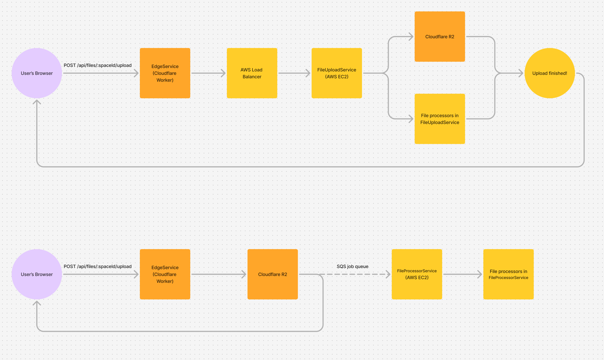

# \[2024-08-26\] Files

## Context

Users need to be able to attach arbitrary files to Alpine content. Attaching files provides a way to
share work generated in other programs and to add visuals to Alpine content which is otherwise text
based.

We must support the following file format categories:

- **Images:** Used to add visuals to Alpine content.
- **Videos:** Videos are incredibly information dense. They're useful for sharing status updates,
  bug reports, and more.
- **PDFs:** The standard vector document format. Basically all document formats can be converted
  into PDF.

We'd like to also support the following file format categories:

- **Microsoft Word/Excel/PowerPoint:** You should be able to share content created with Microsoft's
  tools in Alpine.
- **Audio:** If we support video it's an obvious extension to also support audio.
- **Code:** For developers, it's useful to be able to upload code files and have them be syntax
  highlighted (e.g. a large `.yaml` configuration file).

Within these file format categories, we'd like to support at least
[all the file formats that Canva supports](https://www.canva.com/help/upload-formats-requirements/).

- Images: JPEG, PNG, HEIC/HEIF, WebP, SVG, GIF
- Video: MOV, MP4, MPEG, MKV, WebM
- Audio: M4A, MP3, OGG, WAB, WebM

We need to be able to attach files to all the kinds of content across our product.

- Chat messages
- Documents (and document comments)
- Posts (and post comments)
- Tasks (and task comments)

Each file needs to be previewed inline within the content its attached to and when you click on the
file we should open up a full screen attachment viewer.

## Decision

### Overview

- All files are stored in
  [Cloudflare R2](https://www.cloudflare.com/developer-platform/products/r2/) (which has no egress
  fees unlike AWS S3)
- We upload files through our `EdgeService` Cloudflare Worker
- Files are processed by a new service in AWS `FileProcessorService`
- After uploading a file, `EdgeService` adds a job to process the file to an AWS SQS queue, this job
  is picked up by `FileProcessorService`
- Files are served and cached from our `EdgeService` Cloudflare Worker
- File access is authenticated with signed URLs generated by `AppService` and verified at the edge
  by our `EdgeService` Cloudflare Worker
- `FileProcessorService` also exposes an HTTP server with a resize route we use for resizing files,
  resized files are then cached by our `EdgeService` Cloudflare Worker

### File processors

The following are summaries of all the file processors in `FileProcessorService`. We include actions
we need to take for each file type along with the tools we use.

- Web safe images (e.g. PNG and JPEG)
    - Actions: Read metadata, generate placeholder blur
    - Tools: [sharp](https://sharp.pixelplumbing.com/)
- Web unsafe images (e.g. HEIC)
    - Actions: Read metadata, generate placeholder blur, generate AVIF preview image
    - Tools: [sharp](https://sharp.pixelplumbing.com/)
- Web safe videos (e.g. WebM and some MP4 codecs)
    - Actions: Read metadata, generate thumbnail at 10s mark, generate thumbnail placeholder blur
    - Tools: [FFmpeg](https://www.ffmpeg.org/), [sharp](https://sharp.pixelplumbing.com/)
- Web unsafe videos (e.g. MOV and MKV)
    - Actions: Read metadata, generate thumbnail at 10s mark, generate thumbnail placeholder blur,
      transcode WebM video
    - Tools: [FFmpeg](https://www.ffmpeg.org/), [sharp](https://sharp.pixelplumbing.com/)
- Web safe audio (e.g. WebM and some MP4 codecs)
    - Actions: Read metadata
    - Tools: [FFmpeg](https://www.ffmpeg.org/)
- Web unsafe audio (e.g. OGG)
    - Actions: Read metadata, transcode WebM audio
    - Tools: [FFmpeg](https://www.ffmpeg.org/)
- PDF
    - Actions: Read metadata, generate AVIF preview image from first page, generate preview image
      placeholder blur
    - Tools: [sharp](https://sharp.pixelplumbing.com/) built with
      [PDFium](https://pdfium.googlesource.com/pdfium/)
- Microsoft Word/Excel/PowerPoint
    - Actions: Convert to PDF, read PDF metadata, generate AVIF preview image from PDF first page,
      generate preview image placeholder blur
    - Tools: [LibreOffice](https://www.libreoffice.org/), [sharp](https://sharp.pixelplumbing.com/)
      built with [PDFium](https://pdfium.googlesource.com/pdfium/)
- Code (e.g. JSON and YAML)
    - Actions: Read the first few lines
    - Tools: None

### File model

A simplified version of our file model looks like this:

```ts
type FileModel = {
    spaceId: SpaceId;
    fileId: FileId;
    contentType: FileContentType;
    contentLength: number;
    uploaderId: AccountId;
    isUploading: boolean;
    alternative: FileAlternative | null;
    preview: FilePreview | null;
};

type FileAlternative =
    | {isProcessing: true}
    | {isProcessing: false; ok: false; error: FileProcessorError}
    | {
          isProcessing: false;
          ok: true;
          contentType: FileContentType;
          contentLength: number;
      };

type FilePreview =
    | {isProcessing: true}
    | {isProcessing: false; ok: false; error: FileProcessorError}
    | {
          isProcessing: false;
          ok: true;
          type: "Image";
          size: {width: number; height: number};
          placeholder: FileImagePreviewPlaceholder;
          content?: {contentType: FileContentType; contentLength: number};
          videoDuration?: number;
      }
    | {
          isProcessing: false;
          ok: true;
          type: "Audio";
          duration: number;
          metadata: FileAudioPreviewMetadata;
      }
    | {
          isProcessing: false;
          ok: true;
          type: "Code";
          content: FileCodePreviewContent;
      };
```

When files are first stored in the database `isUploading` is true and `isProcessing` is true for
`alternative` and/or `preview` (if the file has an `alternative` or `preview`). A file is considered
to be done loading once `isUploading` is false and all `isProcessing`s are false. The file is
considered immutable after it's done uploading and processing. Clients will poll a file while its
uploading/pricing and will stop polling once the file has finished.

`alternative` and `preview` also have an `ok` flag. If it's set to false that means processing has
failed and won't be retried. We need to show the `error` property to the user.

Here's a description of the various attributes on the file model:

- `spaceId`: The space the file is in.

- `fileId`: The identifier of the file. Unique within the `spaceId`. `fileId` is a `ChronologicalId`
  which means you can get the file's upload time with `getChronologicalIdTime(fileId)`. This allows
  us to efficiently query files based on their upload order.

- `contentType`: The mime type of a file. The type `FileContentType` can only be a set list of mime
  types that we support. Browse the type and associated documentation comments for complete
  information about the file types we support.

- `contentLength`: The length of the file in bytes. The file will be stored in the Cloudflare R2
  bucket `cyberworlds-files` with the key `${spaceId}/${fileId}`.

- `uploaderId`: The account that uploaded this file. This account always has access to the file no
  matter what entities in our system the file is attached to.

- `isUploading`: Has the file finished uploading? `true` if we haven't finished writing the file to
  Cloudflare R2. `false` once the file is available in the Cloudflare R2 bucket `cyberworlds-files`
  with the key `${spaceId}/${fileId}`.

- `alternative`: If this file type isn't supported by web browsers then `alternative` will contain a
  version of the file that holds exactly the same content but is supported by web browsers. For
  example, HEIC images can't be rendered by the HTML `` tag. So we generate an alternative AVIF
  file for HEIC images. An HEIC image will have a non-null `alternative` property with
  `alternative.contentType` set to `image/avif`. If `alternative` is non-null then the alternative
  file of type `alternative.contentType` and byte length `alternative.contentLength` can be found in
  the Cloudflare R2 bucket `cyberworlds-files` with the key `${spaceId}/${fileId}-alternative`.

    If `isProcessing` is true it means we have an alternative for the file but it hasn't finished
    processing yet.

- `preview`: Information about the file we need to render a preview in the product. For example,
  image previews have `preview.size.width` and `preview.size.height` which is the size in pixels.
  For audio files we have `preview.duration` which is the duration in milliseconds. The preview type
  is not the same as the file type! Videos and PDFs will have image previews. A video image preview
  is the frame after the first 10s of the video. A PDF image preview is the first page of the PDF
  document.

    For image previews, if the file itself is a web safe image then `preview.content` will be
    undefined. Otherwise `preview.content` will be the image we render in a preview. This image is
    stored in the `cyberworlds-files` Cloudflare R2 bucket under the key
    `${spaceId}/${fileId}-preview`.

    For image previews, `preview.placeholder` contains the placeholder blur (generated using a
    similar technique to [plaiceholder](https://plaiceholder.co/docs)) which we render before
    downloading the image so we have something to show the user before the full image is available.

    If `isProcessing` is true it means we have a preview for the file but it hasn't finished
    processing yet.

### Security

Users trust us with their most important files. So it's important we only allow access to files a
user is actually allowed to see. A "dumb" implementation of a file serving backend would rely on
file URLs being hard to guess as its security model. This isn't good enough for us. This section
describes our security model for files.

#### Attachments

When a user uploads a file, only they have access to the file. For other users to see the file the
uploader must grant access to the file by attaching it to some target in our system (attachment
targets are declared by the `FileAttachmentTarget` type). For example, the uploader may attach a
file to a chat so only other members of the chat can see the file.

The only functions we provide for accessing a file are `getFileAsUploader(context, fileId)` and
`getFileFromAttachment(context, fileId, attachmentTarget)`. `getFileAsUploader(context, fileId)`
will always return the file if the actor is the uploader.
`getFileFromAttachment(context, fileId, attachmentTarget)` will only return the file if:

1. The actor has access to the file attachment target
2. The file was indeed attached to the file attachment target

**Warning:** We don't yet implement cleaning up file attachments. So, for example, if a chat message
that contains a file is deleted the message is still considered attached to the chat. Our concept is
to eventually implement a file garbage collector to handle cleanup. See our future work section
“[Build file garbage collection script](#build-file-garbage-collection-script).”

#### Signed URLs

When the server determines that the client is allowed to see a given `FileModel` (by looking at the
file's attachments) it sends the client a signed URL. Well, just the search param portion of the URL
which can be used to construct a signed URL. A signed URL looks like this:

```
https://alpine.inc/files/c2pwxmpv3z7b3db19tsn6y1qfg/069sjebvfv6v2frxmk961338zr
    ?exp=1735671486
    &iss=app
    &aud=edg
    &sig=eyJhbGciOiJIUzI1NiJ9..zkbzr0K2oSSX3a1HOwZrGtdyFLw4274WyOZ7qiIvExA
    &width=600
```

The server only sends the signature search param portion of the URL and expects the client to
reconstruct the full URL and add any optional parameters (like `width` in our example above).

```
?exp=1735671486
&iss=app
&aud=edg
&sig=eyJhbGciOiJIUzI1NiJ9..zkbzr0K2oSSX3a1HOwZrGtdyFLw4274WyOZ7qiIvExA
```

Signed URLs expire 24 hours after they're generated on the server. This way the browser can locally
cache the file for 24 hours before it needs to fetch the file from the server again.

Signed URLs are more or less the same as in a JWT. They have the `iss`, `aud`, and `exp` claims
which behave the same as a JWT. `sig` is a
[detached JWS](https://datatracker.ietf.org/doc/html/rfc7797#section-4.2). Whereas a JWT uses the
format `${protected}.${payload}.${signature}`, a detached JWS omits the payload and uses the format
`${protected}..${signature}`. It's up to the code verifying the JWS to reconstruct the payload from
the URL. The payload will always be `https://alpine.inc/files/${spaceId}/${fileId}` plus the `exp`,
`iss`, and `aud` search params. All other search params added to the URL (e.g. `width` in the
example above) are not included in the signature which means the client may provide arbitrary values
for them.

#### Service isolation

Another important factor of `FileProcessorService`'s security posture is the service needs to be
isolated and given very little access to the rest of our systems. Because `FileProcessorService` has
many third party dependencies with very broad attack surfaces. Including:

- [sharp](https://sharp.pixelplumbing.com/) which in turn has a bunch of dependencies, see
  [THIRD-PARTY-NOTICES.md](../../../../vendor/libvips/THIRD-PARTY-NOTICES.md). One example of a
  dependency is [GraphicsMagick](http://www.graphicsmagick.org/) which is built into sharp has a
  particularly large attack surface.
- [FFmpeg](https://www.ffmpeg.org/)
- [LibreOffice](https://www.libreoffice.org/)

Right now the way we isolate `FileProcessorService` is giving it a very lightweight AWS IAM profile.
It only has access to the `Files` DynamoDB table and can't run `Query` or `Scan` on that table.
We'll likely need to put more work into securing this service. Including:

- Securing its internet access
- Making sure it can't do anything malicious with our Cloudflare R2 token
- Monitoring weird execution patterns which might tell us an attacker has access

### Resizing

An image may be rendered on the client at many sizes. It may be rendered as a small preview square
in a channel's file list or it may be rendered at the full width of a document's content (with the
spacing scale `medium` that's 600px at a 1x screen resolution, 1200px at a 2x screen resolution, and
so on).

We resize files with [FFmpeg](https://www.ffmpeg.org/) from an HTTP route exposed by
`FileProcessorService`. This resize route is invoked by `EdgeService` which caches resized files for
30 days. You can set the `width` search param on the file URL to invoke the resize route.

### Preferred image file format

Whenever we're generating an image, we generate it in the AVIF file format. This includes:

- Alternative web safe images for web unsafe images
- Thumbnail images for videos and PDFs
- Resized images

AVIF has full browser support, provides better compression than JPEG and WebP, and has alpha channel
support (unlike JPEG)
([source](https://medium.com/@julienetienne/why-you-should-use-avif-over-jpeg-webp-png-and-gif-in-2024-5603ac9d8781),
[source](https://jakearchibald.com/2020/avif-has-landed)). If we didn't use AVIF we'd have to either
use JPEG or PNG depending on whether the file has an alpha channel. PNG doesn't compress well and
AVIF provides better compression than JPEG.

### Resource utilization

Processing files can be resource intensive. To manage the resources of the machine
`FileProcessorService` is running on we implement cooperative scheduling. Unlike our other Node.js
services we don't run `FileProcessorService` in a cluster. Instead we run one JavaScript which runs
our cooperative scheduler, `JobQueueConsumer`. `JobQueueConsumer` runs execution
[fibers](<https://en.wikipedia.org/wiki/Fiber_(computer_science)>) (lightweight threads managed by
our program) in which file processing actually happens.

At a high level `FileProcessorService`:

- Runs 1 JavaScript thread
- Runs N fibers concurrently where N is the number of CPU cores on the machine running our service
- A fiber can process (or resize) one file at a time

So at most `FileProcessorService` can only process one file for each CPU core of the machine its
running on.

This load balances nicely with AWS SQS. If a given `FileProcessorService` is "full" it won't receive
new jobs. Letting another `FileProcessorService` which hasn't used all its fibers pick up the job.

This system is worse for file resizing though. `EdgeService` sends resize requests to an HTTP server
provided by `FileProcessorService` and load balanced by
[AWS ALB](https://docs.aws.amazon.com/elasticloadbalancing/latest/application/introduction.html).
The file resizing HTTP request must wait for a fiber to become available in `FileProcessorService`
before it can start resizing the file. This means if the request reaches a full
`FileProcessorService` it might have to wait a second or two before being able to respond. We may
want to consider moving file resizing somewhere else to improve resize HTTP request latencies.
Perhaps an AWS lambda or a Rust Cloudflare Worker which runs on the edge.

We'll want to run `FileProcessorService` on AWS's compute optimized EC2 instances. For example,
`c8g.2xlarge` seems like a good instance type with 8 CPU cores and 16 GiB of memory. Then each
`FileProcessorService` can chew through 8 files at once.

## Consequences

`FileProcessorService` is incredibly resource intensive. It needs at least 4 GiB memory to resize
even 10 MB images. (This is based on trial and error. It's possible I've configured FFmpeg wrong
since this memory requirement seems bananas.) This means the cost of the servers running
`FileProcessorService` will be quite high.

`FileProcessorService` also has a bunch of third-party dependencies which broadens its attack
surface area (see [service isolation](#service-isolation)). This means we'll likely need to invest
in security for this service on an ongoing basis.

By building a custom file upload and processing backend we've created a huge maintenance burden for
Alpine. Since files are so important to our product we believe it's best to own our file stack so we
can optimize it for cost and user experience. For example, no vendors we looked at generated image
preview blurs which we believe is essential to a good user experience for files.

## Alternatives considered

Originally, instead of uploading files to Cloudflare R2 in `EdgeService` we'd upload files in
`FileProcessorService` (then called `FileUploadService`) in parallel with processing them.
Ultimately, we moved away from this model to instead uploading files in Cloudflare R2 and processing
after uploading finishes because:

- We were running into bugs we just couldn't solve where the AWS load balancer would mysteriously
  stop sending the bytes for large files to our EC2 `FileProcessorService` instance.
- Many file processors needed to wait for the full file to be uploaded before they could start
  anyway, defeating the point of parallelizing uploading and processing. Even video file processors
  which we were expecting to benefit from the parallelism (some video file processors need to be
  able to seek to different positions within the video so don't support stream based processing).
- We discovered in production that
  [Cloudflare Workers have a 100 MB request body limit](https://developers.cloudflare.com/workers/platform/limits).
  So to upload files up to 1 GB we needed to implement support for multipart uploads. This would
  have been very painful to add support for in our old streaming `FileProcessorService`
  implementation.

Below is a diagram comparing the two architectures. The old architecture with `FileUploadService` is
on the top. The new architecture we ultimately decided on with `FileProcessorService` is on the
bottom:



Other considerations:

- We evaluated [Cloudflare R2](https://www.cloudflare.com/developer-platform/products/r2/) vs
  [AWS S3](https://aws.amazon.com/s3/) for object storage. Cloudflare R2 has hands down better
  pricing (since there's no egress fees) and we hope better performance given we upload and serve
  files through a Cloudflare Worker.

- We evaluated
  [Cloudflare Stream](https://www.cloudflare.com/developer-platform/products/cloudflare-stream/) for
  videos but the pricing is way to expensive for our user generated content use case.

- We evaluated
  [Cloudflare Images](https://www.cloudflare.com/developer-platform/products/cloudflare-images/) for
  image resizing but it
  [doesn't support AVIF as an input format](https://community.cloudflare.com/t/support-avif-as-input-images/667113)!
  Given AVIF is our preferred format for generating images Cloudflare Images can't work for us so we
  built our own image resizing route in `FileProcessorService`. If Cloudflare Images adds support
  for AVIF as an input format we'd love to replace our image resizing route in
  `FileProcessorService` with Cloudflare Images. I imagine Cloudflare Images performs resizing at
  the edge which would be amazing for performance.

## Future work

There are a couple key missing pieces in our file backend implementation we'll need to add
eventually. Documenting the important pieces we know about here.

### Transition unused objects to infrequent access to reduce storage costs

Many files stored in Alpine will never be viewed 90 days after they're uploaded. For example, a file
added to a chat message. Reviewing old chat messages is relatively rare. We should move files that
aren't being accessed to Cloudflare R2's infrequent access storage tier to save costs.

We could easily add a rule to automatically transition files to the infrequent access tier after 90
days but we need to do some data analysis to make sure this is actually cost effective for us first.
Since there are likely some images which _do_ get accessed frequently even 90 days after upload
(e.g. images in an onboarding document). If we incorrectly move such files into Cloudflare's
infrequent access tier then we'll get hit with fees when reading the files. Are those fees worse
than the savings from moving inactive files to an infrequent access tier? That's what we need to
look at data to see.

### Build file garbage collection script

Right now, once a file is attached to an attachment target the attachment lives forever. Even if the
user deletes the file from the attachment target. For example, if the user attaches a file to a
message in a chat then deletes the chat message we don't detach the file from the chat! We should
build a garbage collection script that checks whether file attachments are still valid then deletes
the attachment if not.

If a file has zero attachments 30 days after it's been uploaded the garbage collection script should
also delete the file altogether! If a user has deleted their data from Alpine we should not keep it
around in our systems.

The garbage collection script should also detect failed uploads. Right now we can get into a state
where a file item exists in DynamoDB but the Cloudflare R2 upload fails and the DynamoDB item never
gets cleaned up. Or the Cloudflare R2 upload finishes but there's a failure before we can set
`isUploading: false` in DynamoDB and kickoff the processing job. A garbage collection script should
clean these cases up.

So to summarize, the garbage collection script should:

1. Check that file attachments are still valid
2. Delete files that have no more attachments
3. Cleanup failed file uploads

### Detect CSAM and remove it from our systems

Running an online service means people may try using it for illegal activities. We should be good
citizens and occasionally check files uploaded to our service for CSAM and other illegal files. If
we find such files we should immediately delete them and report the incident to law enforcement.
